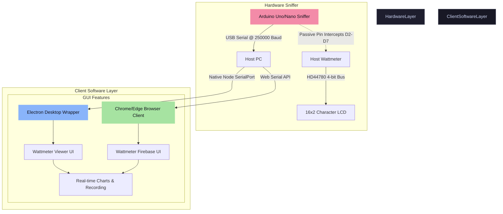

# Bayucaraka TD Wattmeter Suite ⚡

[](https://opensource.org/licenses/MIT)
[](https://nodejs.org/)
[](https://www.electronjs.org/)
[](https://firebase.google.com/)

A comprehensive, production-grade hardware sniffing and real-time visualization suite developed by **Bayucaraka**. This system intercepts character data from an HD44780-compatible 16x2 LCD bus of a commercial wattmeter using an Arduino Uno, processes it, and streams the metrics to high-performance desktop (Electron) and web (Firebase Hosting via Web Serial) client interfaces.

---

## 📐 System Architecture

The following diagram illustrates how the system non-invasively snips LCD data, decodes it, streams it over a high-baud-rate serial connection, and displays real-time telemetry:



---

## 🗂 Repository Directory Layout

To maintain a clean and professional repository structure, the codebase is organized as follows:

```text
.
├── WattmeterSniffer/       # Arduino firmware for HD44780 4-bit bus sniffing
│   └── WattmeterSniffer.ino# Principal Arduino sketch with high-speed interrupt handler
├── WattmeterViewer/        # Core HTML5/CSS3/JS frontend dashboard
│   ├── src/                # Charting, UI, state-machine, and recording modules
│   └── start-viewer.sh     # Bash script to test the viewer locally in a browser
├── electron/               # Native Electron wrapper files
│   ├── main.js             # Electron main process (OS serial port manager)
│   └── preload.js          # Secure bridge (IPC renderer methods)
├── WattmeterFirebase/      # Production Firebase Hosting public build
│   ├── src/                # Web Serial API-adapted dashboard modules
│   ├── index.html          # Main HTML entry
│   └── 404.html            # Custom routing fallback handler
├── drivers/                # Device driver binaries and instructions
│   └── CH340/              # CH340 USB-Serial drivers for clone boards
├── scripts/                # Node build and development utility scripts
├── package.json            # Node project configuration, scripts, and build paths
└── firebase.json           # Firebase Hosting and Emulator configurations
```

---

## 🔌 Hardware Wiring & Sniffer Connections

The sniffer connects **passively** (high-impedance inputs) to the HD44780 LCD lines of the host wattmeter. This allows the sniffer to intercept and decode commands without interfering with the wattmeter's native operations.

### LCD Sniffer Wiring Table

| Arduino Uno Pin | LCD Pin Function | Description |
| :--- | :--- | :--- |
| **D2** | **RS** (Register Select) | Intercepts instruction/data mode changes |
| **D3** | **E** (Enable) | Drives the high-speed read/write interrupt trigger |
| **D4** | **D4** (Data Bit 4) | High nibble / Low nibble multiplexed line |
| **D5** | **D5** (Data Bit 5) | High nibble / Low nibble multiplexed line |
| **D6** | **D6** (Data Bit 6) | High nibble / Low nibble multiplexed line |
| **D7** | **D7** (Data Bit 7) | High nibble / Low nibble multiplexed line |
| **GND** | **VSS / GND** | Common ground reference with the host wattmeter |

> [!IMPORTANT]  
> A common ground connection between the Arduino Uno and the host wattmeter is **strictly required** to prevent signal degradation and incorrect decoding.

---

## 🚀 Quick Start Guide

This project is set up as an integrated Node.js project using `pnpm` (or `npm`/`yarn`) to manage the Desktop App workspace and deployment routines.

### 1. Program the Arduino Sniffer
1. Open the [WattmeterSniffer.ino](file:///home/wistarabanyukayana/Documents/Bayucaraka/arduino-workspace/Wattmeter/WattmeterSniffer/WattmeterSniffer.ino) sketch in the Arduino IDE.
2. Select **Arduino Uno** (or your corresponding board).
3. Compile and upload the sketch to your board.
4. Verify the sniffer is working by opening the Serial Monitor at **250000 baud**. You should see data strings beginning with `DATA,...`.

### 2. Desktop Application (Electron)
The Electron version utilizes the native C++ `@serialport/bindings-cpp` module to provide low-level serial access.

```bash
# Install dependencies
pnpm install

# Start the desktop application in development mode
pnpm start

# Compile and package binaries for your current platform
pnpm run package:dir
```

### 3. Web Client (Firebase Hosting)
The web version utilizes the modern in-browser **Web Serial API**, making the dashboard fully serverless and executable in secure contexts on any Chromium-based browser (Chrome, Edge, Opera) without any software installation.

```bash
# Run the Firebase Local Emulator (starts hosting on http://localhost:5000)
firebase emulators:start --only hosting

# Deploy directly to Firebase live production environment
firebase deploy --only hosting
```

---

## 🛠 Developer Scripts & Testing

We provide dedicated tooling to verify codebase health:

- **Syntax Validation**: Run `pnpm run check` to perform syntax checks across all JS/preload files.
- **Production Builds**: Build installers for various operating systems with:
  - `pnpm run dist:linux` for Linux (AppImage)
  - `pnpm run dist:win` for Windows (NSIS Installer)

---

## 📝 License & Contact

This project is licensed under the MIT License. Created and maintained by **Wistara Banyu Kayana** and the **Bayucaraka** team.
